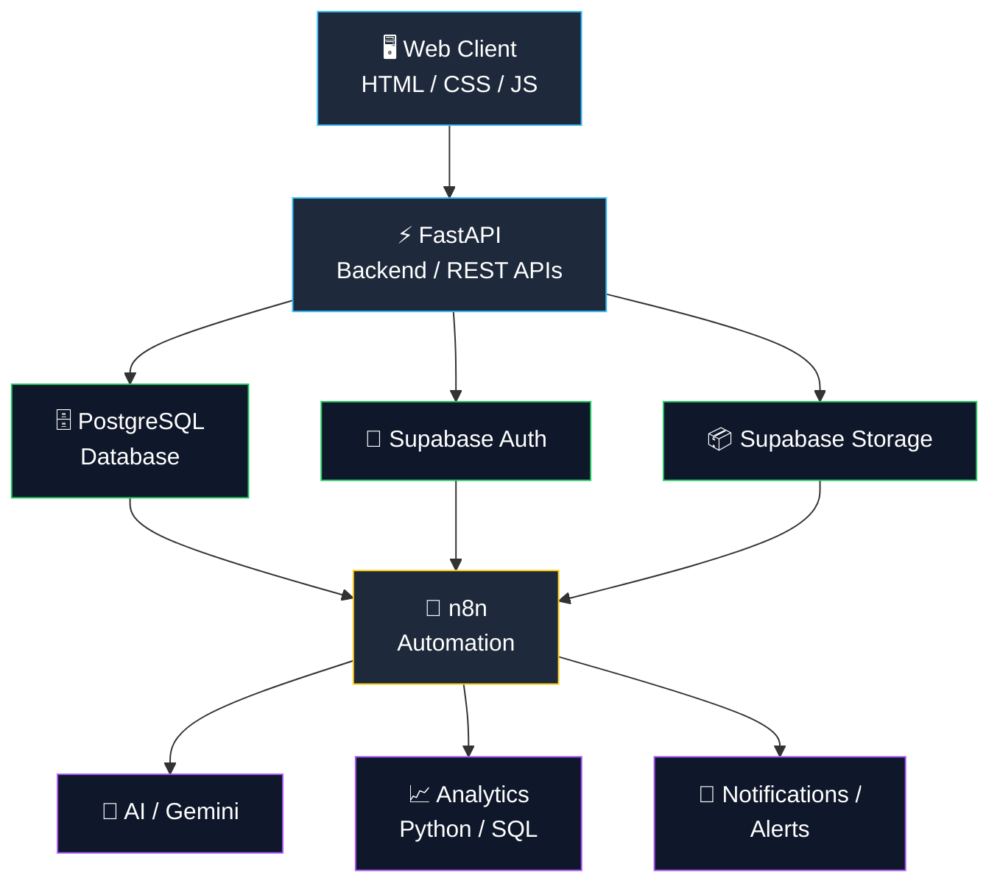
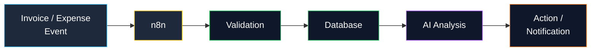
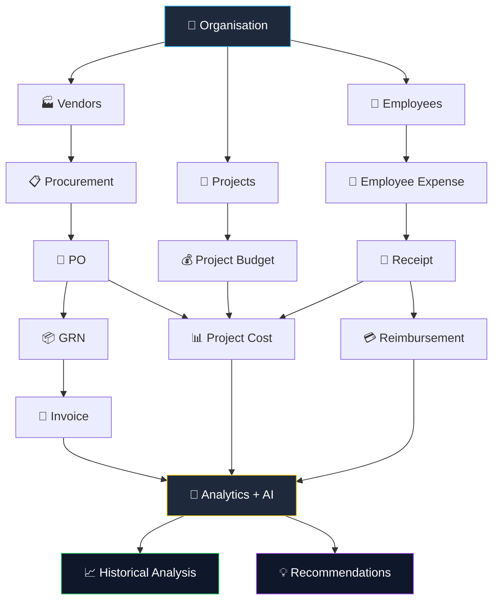
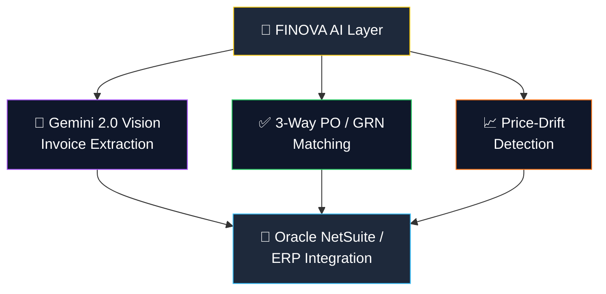
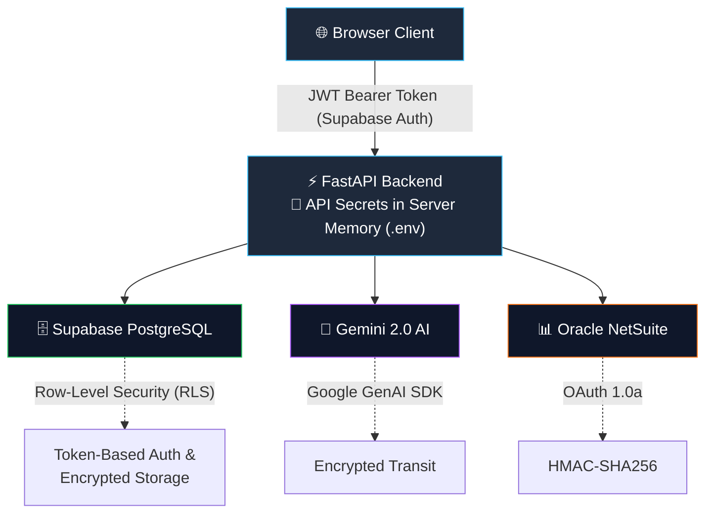

# 🚀 FINOVA
### *by Neuronauts*

**AI-Powered Procurement, Invoice, Expense & Project Cost Intelligence Platform**

*Finance + Innovation + Intelligence*

---

FINOVA is an AI-powered financial operations platform that helps organizations manage **vendors, procurement, invoices, employee expenses, reimbursements, project costs, and payments** in one centralized system.

Unlike traditional financial management systems, which primarily record and report transactions, FINOVA goes further — analyzing historical financial data, detecting anomalies, surfacing cost-saving opportunities, forecasting future expenses, and delivering explainable recommendations to support better business decisions.

 

## 📑 Table of Contents

- 🎯 [Problem Statement](#problem-statement)
- 💡 [Our Core Idea](#our-core-idea)
- 🔬 [Research Gap](#research-gap)
- ⭐ [Unique Selling Proposition](#unique-selling-proposition)
- 🧩 [Minimum Viable Product](#minimum-viable-product)
- 🏢 [Target Users](#target-users)
- 🏗️ [System Architecture](#system-architecture)
- 🔄 [Core Business Workflow](#core-business-workflow)
- 🏢 [Enterprise-Grade ERP & NetSuite Modules](#enterprise-grade-erp--netsuite-modules)
- 🔒 [Security & Authentication](#security--authentication)
- 🌟 [Vision](#vision)

 

---

 

## 🎯 Problem Statement

> ### Invoice and Expense Management

Organizations often manage procurement, invoices, employee expenses, reimbursements, and project costs through disconnected systems, spreadsheets, emails, and manual workflows. This creates several recurring challenges:

| ⚠️ Challenge | Impact |
|---|---|
| Lack of centralized financial visibility | Slower, riskier decisions |
| Manual invoice and expense processing | Wasted time, human error |
| Duplicate or incorrect invoices | Overpayment, lost money |
| Mismatches between PO, GRN, and invoices | Reconciliation headaches |
| Difficult employee reimbursement management | Employee frustration |
| Poor visibility into actual project costs | Budget surprises |
| Vendor price increases going unnoticed | Silent margin erosion |
| Unexpected project budget overruns | Missed targets |
| Limited financial forecasting | Reactive, not proactive |
| Decisions based on hindsight, not insight | Missed opportunities |

FINOVA addresses these challenges by combining **financial management, procurement workflows, automation, analytics, and AI-driven intelligence** into a single platform.

 

---

 

## 💡 Our Core Idea

Traditional financial systems primarily answer:

> **"What happened?"**

FINOVA is built to answer:

> **"What happened, why did it happen, what is likely to happen next, and what should the organization do about it?"**

FINOVA analyzes:

`Historical purchases` · `Vendor behavior` · `Invoice data` · `Employee expenses` · `Project expenses` · `Payment history` · `Procurement patterns` · `Subscription spending`

...and converts this information into **actionable, explainable recommendations**.

 

---

 

## 🔬 Research Gap

Platforms such as **Zoho, SAP Concur, and Coupa** already offer extensive capabilities across invoice management, expense management, vendor management, procurement, approvals, automation, and analytics.

FINOVA is **not intended to replicate these existing features**. Instead, it focuses on an intelligence layer that uses an organization's **own historical financial and procurement data** to support proactive decision-making.

### 🧭 Key Research Direction

> **Historical Procurement Intelligence and Explainable Recommendations**

FINOVA compares current transactions against historical organizational data to identify:

`Price increases` · `Unusual spending` · `Vendor performance changes` · `Repeated purchases` · `Duplicate procurement` · `Cost anomalies` · `Subscription duplication` · `Budget risks`

The system then generates evidence-based recommendations grounded in this analysis.

<table>
<tr><td>

**📌 Example**

Vendor A's laptop price increased by **14%** compared to the organization's six-month purchasing history.

Similar products were previously purchased from Vendor B at a lower price.

**✅ Recommendation:** Request a quotation from Vendor B, or renegotiate pricing with Vendor A.

</td></tr>
</table>

Every recommendation is backed by **historical data and measurable evidence** — not a generic AI response.

 

---

 

## ⭐ Unique Selling Proposition (USP)

| | |
|---|---|
| 🎯 **Evidence-based, not generic AI** | Every recommendation is backed by an organization's own historical purchase, vendor, and expense data rather than a generic AI response. |
| 🔗 **Unified financial intelligence layer** | Brings procurement, invoicing, expenses, reimbursements, and project costs together, instead of leaving them siloed across spreadsheets, emails, and disconnected tools. |
| 📈 **Proactive, not just reporting** | Moves beyond "what happened" dashboards to explain *why* it happened, forecast *what's next*, and recommend *what to do*. |
| 🚨 **Anomaly and price-drift detection** | Automatically flags vendor price increases, duplicate invoices, PO/GRN/invoice mismatches, and duplicate subscriptions before they become costly. |
| 🔍 **Explainability at the core** | Recommendations are traceable to specific historical transactions and measurable evidence, building trust in AI-driven decisions. |
| 👥 **Built for real organizational roles** | Purpose-built workflows for procurement managers, finance teams, project managers, employees, CFOs, and vendors, rather than a one-size-fits-all interface. |

 

---

 

## 🧩 Minimum Viable Product (MVP)

The MVP focuses on proving the core intelligence loop — **capture data → detect patterns → generate explainable recommendations** — before expanding into the full platform.

### ✅ Core MVP Features

- 🏢 **Vendor Management** — Add and manage vendor profiles and basic performance data
- 📋 **Procurement Workflow** — Create Purchase Orders (PO), record Goods Received Notes (GRN), and match them against invoices
- 🧾 **Invoice Management** — Upload, store, and track invoice status
- 💳 **Employee Expense & Reimbursement** — Submit expenses/receipts and track reimbursement status
- 📊 **Project Cost Tracking** — Assign expenses to projects and monitor budget vs. actual spend
- 🔎 **Historical Comparison Engine** — Compare current purchases/invoices against historical data
- 🚨 **Anomaly Detection (v1)** — Flag price increases, duplicate invoices, and duplicate subscriptions
- 💡 **Explainable Recommendations** — Generate a basic recommendation report with supporting evidence (e.g., *"Vendor A price increased X% — compare with Vendor B"*)
- 🖥️ **Role-Based Dashboards** — Simple views for Procurement Manager, Finance Team, Project Manager, Employee, and CFO/Management

<b>🔭 Out of Scope for MVP (Future Phases)</b>

 

- Advanced forecasting models
- Multi-currency and multi-entity support
- Deep ERP/accounting software integrations
- Automated approval workflows with custom rules engines
- Vendor self-service portal (beyond basic invoice submission)

 

---

 

## 🏢 Target Users

`Startups` · `SMBs` · `Educational Institutions` · `Manufacturing` · `Healthcare` · `Construction` · `Retail` · `Service-Based Companies` · `Project-Based Teams` · `Large Enterprises`

 

### 👤 Primary Users

<table>
<tr>
<td width="33%" valign="top">

**👨‍💼 Procurement Manager**
- Manage vendors
- Create purchase orders
- Analyze vendor performance
- Compare historical prices
- Identify cost-saving opportunities

</td>
<td width="33%" valign="top">

**💰 Finance / Accounts Team**
- Manage invoices
- Verify expenses
- Track accounts payable
- Process reimbursements
- Monitor payments

</td>
<td width="33%" valign="top">

**📊 Project Manager**
- Track project budgets
- Monitor project expenses
- View actual project cost
- Detect budget overruns

</td>
</tr>
<tr>
<td width="33%" valign="top">

**👨‍💻 Employee**
- Submit expenses
- Upload receipts/invoices
- Request reimbursement
- Track reimbursement status

</td>
<td width="33%" valign="top">

**🧑‍💼 Management / CFO**
- Monitor org-wide spending
- Analyze vendor performance
- Review financial trends
- Identify cost-saving opportunities
- Monitor financial risks

</td>
<td width="33%" valign="top">

**🏢 Vendor**
- Submit invoices
- Track invoice status
- Monitor payment status

</td>
</tr>
</table>

 

---

 

## 🏗️ System Architecture

**Automation flow:**

### ⚙️ Stack Overview

| Layer | Technology |
|---|---|
| 🖥️ **Frontend** | HTML, CSS, JavaScript |
| ⚡ **Backend** | FastAPI (REST APIs) |
| 🗄️ **Data layer** | PostgreSQL, Supabase (Auth + Storage) |
| 🔁 **Automation layer** | n8n |
| 🤖 **Intelligence layer** | Gemini AI, Python/SQL analytics |
| 🔔 **Output layer** | Notifications / Alerts |

 

---

 

## 🔄 Core Business Workflow

 

---

 

## 🏢 Enterprise-Grade ERP & NetSuite Modules

### 🔄 ERP Integration Mapping

| FINOVA | NetSuite |
|---|---|
| Invoice | Vendor Bill |
| Purchase Order | Purchase Order |
| Receipt / GRN | Item Receipt |
| Expense | Expense Report |

### ✨ Enterprise Features

- 🔄 Bi-directional SuiteTalk REST API sync
- 📑 Automatic double-entry GL mapping (Debit / Credit)
- 🏢 Auto allocation for Department, Class & Location
- 📊 Real-time budget commitment & encumbrance checks

 

---

 

## 🔒 Security & Authentication

 

---

 

## 🌟 Vision

**FINOVA transforms organizational financial data into intelligent, explainable and actionable decisions.**

Built with ❤️ by **Neuronauts** in the ZENESIS 12-hour Hackathon

### 🚀 FINOVA
*Finance + Innovation + Intelligence*

